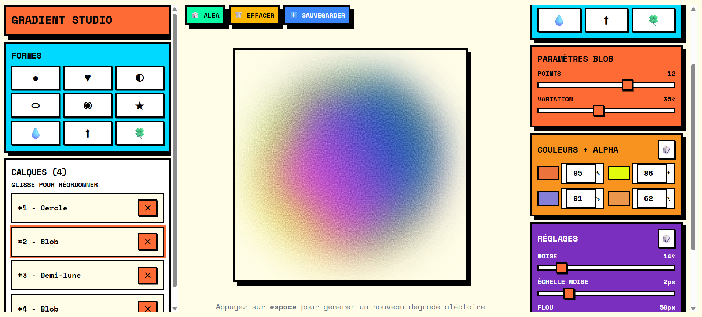

## Gradient Shape Studio

Générateur interactif de formes dégradées bruitées et floues (noisy, blurry gradient shapes).

Cette application permet de créer des calques composés de formes  stylisées, d'appliquer des dégradés, du flou et du "noise" pour obtenir des rendus visuels texturés et organiques.

Capture



Principales fonctionnalités
- Ajouter rapidement des formes (cercles, étoiles, flèches, blobs, trèfles, etc.) en cliquant sur une forme.
- Chaque forme est ajoutée comme un calque avec couleurs, opacités et paramètres générés aléatoirement.
- Édition en temps réel : cliquer sur un calque l'ouvre dans le panneau d'édition (droite) et applique immédiatement les modifications.
- Réglages par calque : couleurs, alpha (opacité), noise intensity/scale, blur, rotation, taille et paramètres spécifiques à la forme (branches, profondeur, points, etc.).
- Randomize global (`Espace`) : génère une composition aléatoire.
- Export : télécharger le canvas au format PNG.

Installation

Prérequis : Node.js >= 18

1. Installer les dépendances :

```bash
npm install
```

2. Lancer le serveur de développement :

```bash
npm run dev
```

Utilisation

- Colonnes :
	- Gauche : sélection de formes (+ ajout) et liste des calques.
	- Centre : canvas et actions globales (randomize, clear, download).
	- Droite : panneau d'édition pour le calque sélectionné.
- Ajouter une forme : cliquer sur l'icône d'une forme dans la colonne gauche.
- Éditer un calque : cliquer sur un calque dans la liste à gauche pour l'ouvrir à droite.
- Modifier les couleurs et alphas : dans le panneau d'édition, les changements sont appliqués en temps réel.
- Changer la forme d'un calque : dans le panneau d'édition, sélectionner une nouvelle forme (mise à jour immédiate).
- Raccourci : appuyer sur `Espace` pour randomizer la composition.

Structure du projet

- `src/` : code source React + TypeScript
	- `components/` : composants UI (AddShapeSelector, EditPanel, LayersList, CanvasDisplay, etc.)
	- `providers/GradientStudioProvider.tsx` : logique métier, état global, rendu canvas et persistance localStorage
	- `utils/` : factories pour paramètres de forme
- `public/` : ressources publiques

Persistance
- L'état est sauvegardé dans `localStorage` pour restaurer la session entre rechargements.

Contribuer

Les contributions sont bienvenues : bugs, idées d'amélioration, nouvelles formes ou presets.

1. Fork du dépôt
2. Créer une branche descriptive
3. Ouvrir une pull request

Licence

Ajoutez ici la licence souhaitée (MIT, Apache, ...)

---

